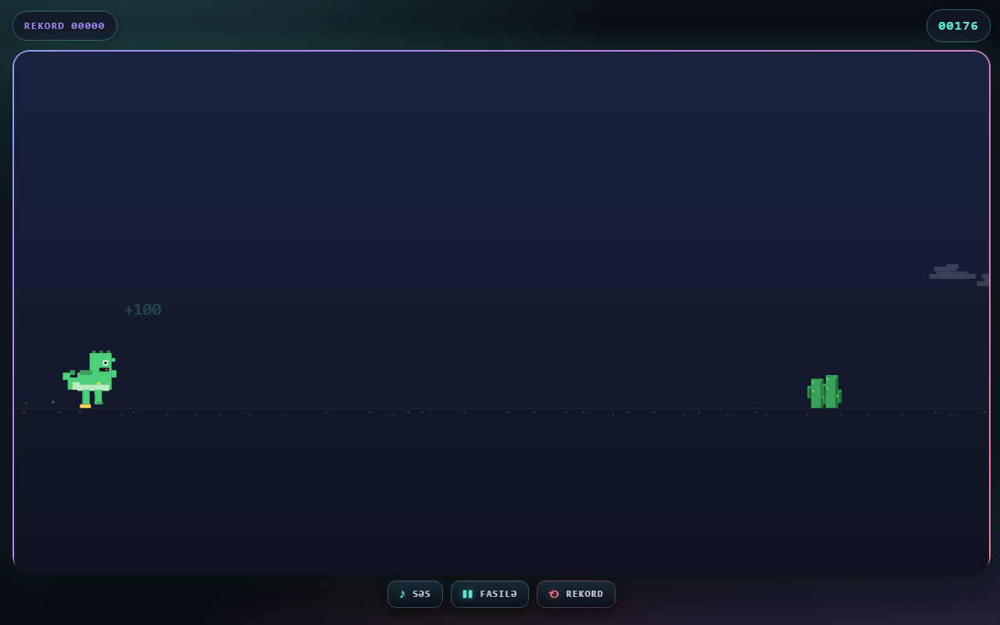
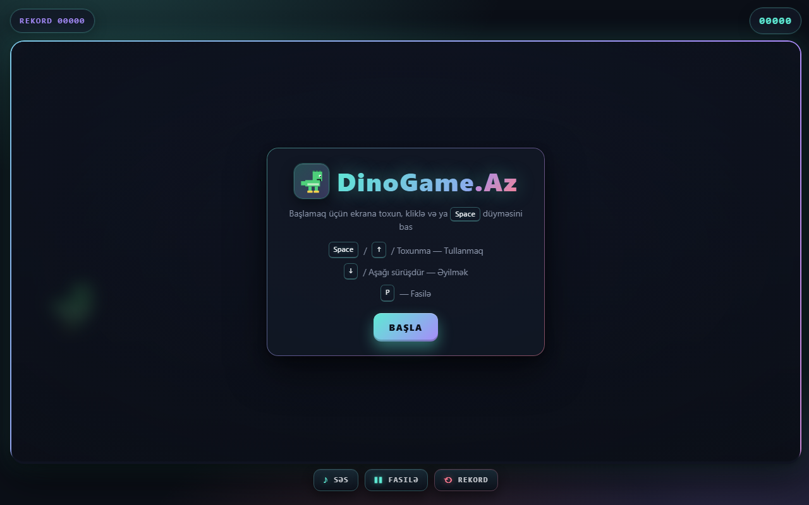
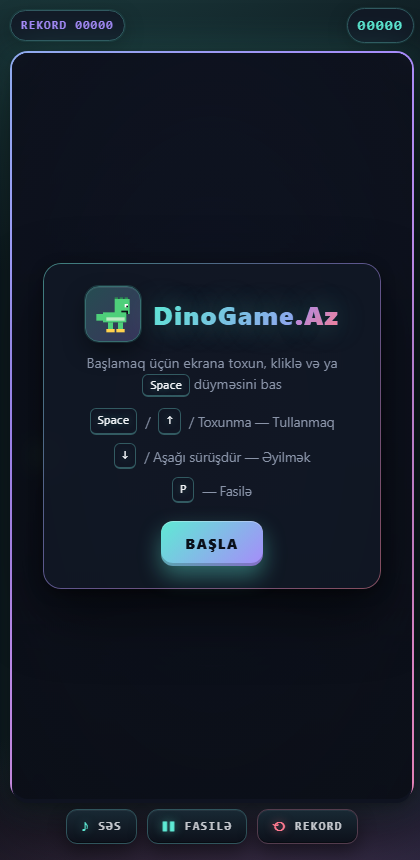

<div align="center">

# DinoGame.Az

**Google Chrome-un məşhur oflayn dinozavr oyununun cilalanmış, mobil və masaüstü üçün tam uyğunlaşdırılmış versiyasıdır. Saf HTML, CSS və JavaScript ilə hazırlanmışdır.**

[](https://goshgarhasanov.github.io/dino-qacis/)
[](#lisenziya)
[](#)
[](#)
[](https://kofe.al/@goshgarhasanov)
[](https://goshgarhasanov.github.io/dino-qacis/)

</div>

---

## Canlı Demo

Brauzerdə birbaşa oynamaq üçün aşağıdakı linkə daxil olun:

> **→ [https://goshgarhasanov.github.io/dino-qacis/](https://goshgarhasanov.github.io/dino-qacis/)**

Heç bir quraşdırmaya, qeydiyyata və ya kukiyə ehtiyac yoxdur — səhifəni açın və oynamağa başlayın.

---

## Ekran görüntüləri

<div align="center">

### Oyun anı



### Başlıq və mobil görünüş

<table>
  <tr>
    <td align="center" width="55%">
      <strong>Başlıq ekranı (masaüstü)</strong><br/>
      
    </td>
    <td align="center" width="45%">
      <strong>Mobil — başlıq</strong><br/>
      
    </td>
  </tr>
</table>

</div>

---

## Xüsusiyyətlər

| | |
|---|---|
| **Rəngli piksel qrafika** | Yaşıl T-Rex (qarın, kürək tikanları, pəncələr və dili ilə birlikdə), bənövşəyi pteranadon və kölgəli kaktuslar |
| **60 FPS canvas** | Sabit zaman addımlı (fixed-timestep) fizika; FPS dəyişikliyindən asılı olmayan oyun gedişatı |
| **Gündüz – gecə dövrü** | Hər 300 xaldan sonra rəng paleti dəyişir, ay və ulduzlar görünür |
| **Tam responsiv interfeys** | 320 piksel enli portret telefondan tutmuş geniş masaüstü ekranlarına qədər istənilən ölçüdə işləyir |
| **Web Audio səslər** | Tullanma, hər 100 xalda və zərbə anında səslər anlıq olaraq sintezlə yaradılır (heç bir audio fayl yoxdur) |
| **Rekordun saxlanması** | `localStorage` vasitəsilə brauzerin yaddaşında qalır; istənilən an sıfırlamaq mümkündür |
| **Vizual effektlər** | Ayaq altından qaldırılan toz hissəcikləri, "+100" yazısı və çarpışma anında ekran sarsıntısı |
| **Tünd və açıq tema** | Sistem rejiminə avtomatik uyğunlaşır |
| **Əlçatanlıq** | `prefers-reduced-motion` parametrinə hörmət edir, klaviatura ilə tam idarə oluna bilir |
| **Avtomatik fasilə** | Səhifə fonda olduqda oyun özbaşına dayanır |

---

## İdarəetmə

### Masaüstü

| Hərəkət | Düymələr |
|---|---|
| Tullanmaq | `Space` · `↑` · siçanın sol düyməsi |
| Əyilmək | `↓` (basılı saxlanılır) |
| Fasilə vermək | `P` |
| Yenidən başlamaq | `Enter` · `R` · ekrana klik |

### Mobil

| Hərəkət | Toxunma |
|---|---|
| Tullanmaq | Ekrana toxunma və ya **▲** düyməsi |
| Əyilmək | **▼** düyməsini basılı saxlamaq |
| Fasilə | Aşağıdakı **Fasilə** düyməsi |
| Səsi açmaq və ya bağlamaq | **Səs** düyməsi |
| Rekordu sıfırlamaq | **Rekord** düyməsi (təsdiq tələb edir) |

---

## Lokal işə salmaq

Bu, build addımı olmayan statik bir saytdır. İstənilən statik server kifayət edir:

```bash
# 1) Node ilə
npx serve .

# 2) Python ilə
python -m http.server 8000

# 3) VS Code istifadəçiləri üçün — "Live Server" genişlənməsi
```

Sonra brauzerdə `http://localhost:8000` ünvanına daxil olun və oynayın.

---

## Layihənin strukturu

```
dino-qacis/
├─ index.html     # HTML markup, HUD, overlay, toxunma paneli
├─ styles.css     # responsiv layout, tünd və açıq tema, animasiyalar
├─ game.js        # oyun döngüsü, fizika, rəsm, idarəetmə
├─ README.md      # bu sənəd
└─ .gitignore
```

### Texniki yanaşma

- **Saf vanilla JavaScript** — heç bir framework, kitabxana və ya build addımı istifadə olunmur.
- **Canvas 2D** — bütün rəsmlər `ctx.fillRect` ilə çəkilir; sprite sheet və ya xarici şəkil faylı yoxdur.
- **Fixed-timestep oyun döngüsü** — 60 FPS-də sabit fizika; monitorun yeniləmə tezliyindən asılı deyil.
- **Web Audio API** — bütün səslər ossilator və amplituda zərfi (envelope) ilə anlıq olaraq sintezləşdirilir.
- **localStorage** — rekord və səs parametrləri sessiyalar arasında saxlanılır.
- **Pointer Events** — masaüstü siçanı və mobil toxunma vahid kod yolu ilə işlənir.

---

## Rəng paleti

| Element | Rəng kodu | Nümunə |
|---|---|---|
| Mint vurğu | `#5eead4` |  |
| Bənövşəyi vurğu | `#a78bfa` |  |
| Çəhrayı vurğu | `#ff7a90` |  |
| T-Rex gövdəsi | `#4ecf7a` |  |
| T-Rex qarnı | `#bdebc3` |  |
| Pəncələr | `#ffd24d` |  |
| Pteranadon | `#7c8cff` |  |
| Kaktus | `#3aa15a` |  |

---

## Çətinlik dinamikası

```
Sürət               : 6.0 → 13.0 piksel / kadr (tədricən artır)
Maneə intervalı     : 1400 ms → ~420 ms (sürətə bağlı azalır)
Pteranadon          : sürət 7.5-i keçəndən sonra ortaya çıxır
Gecə dövrü          : hər 300 xaldan bir aktivləşir
Mərhələ səsi        : hər 100 xal
Rekord              : localStorage-də saxlanılır
```

---

## Brauzer dəstəyi

Müasir brauzerlərin hamısı dəstəklənir:

| Brauzer | Vəziyyət |
|---|---|
| Chrome və Edge ≥ 100 | tam dəstək |
| Firefox ≥ 100 | tam dəstək |
| Safari ≥ 15 (iOS daxil) | tam dəstək |
| Samsung Internet | tam dəstək |

CSS `color-mix()`, `dvh` vahidi və müasir Pointer Events istifadə olunur.

---

## Yol xəritəsi

Növbəti versiyalarda görmək istədiyimiz funksiyalar:

- [ ] Səs gücünün ayrıca tənzimlənməsi
- [ ] Onlayn rekord siyahısı (leaderboard)
- [ ] Dinozavr üçün müxtəlif görünüşlər
- [ ] Bonuslar (qalxan, ikiqat tullanma)
- [ ] PWA dəstəyi — internetsiz oynamaq üçün

İdeya təklif etmək və ya səhv barədə məlumat vermək üçün **Issues** bölməsindən istifadə edə bilərsiniz.

---

## Lisenziya

Bu layihə **[MIT](LICENSE)** lisenziyası altında paylaşılır. Hətta kommersiya məqsədli layihələrdə belə sərbəst istifadə edə, dəyişdirə və yenidən paylaşa bilərsiniz. Yeganə şərt orijinal lisenziya bildirişinin saxlanılmasıdır.

---

<div align="center">

**Bakıda hazırlandı · 2026**

[Demo](https://goshgarhasanov.github.io/dino-qacis/) · [Issues](https://github.com/goshgarhasanov/dino-qacis/issues) · [GitHub](https://github.com/goshgarhasanov/dino-qacis)

</div>
